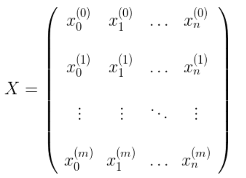
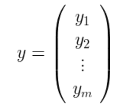
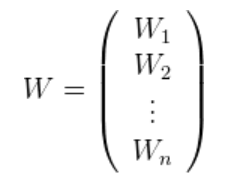

# Closed Form Solution Math

In this , we'll develop the math of the closed form solution, which we introduced in the last video. First, we'll do it for the 2-dimensional case, and then for the general case.

## 2-Dimensional solution
Our data will be the values $x_1, x_2, . . . x_m$ and our labels will be the values  $y_1, y_2, . . . y_n$. Let's call our weights $w_1$ and $w_2$ . Therefore, our predictions are $\hat{y} = w_1x_1 + w_2$ . The mean squared error is

$$E(w_1, w_2) = \frac{1}{2m} \sum_{i=1}^{m} (\hat{y}_i - y_i)^2$$

We need to minimize this error function. Therefore, the factor of $1/2m$ can be ignored. Now, replacing the value of $\hat{y}$, we get

$$E(w_1, w_2) =  \sum_{i=1}^{m} (\hat{y}_i - y_i)^2$$

$$ E(w_1, w_2) =  \sum_{i=1}^{m} (w_1x_i + w_2 - y_i)^2 $$

Now, in order to minimize this error function, we need to take the derivatives with respect to $w_1$ and $w_1$ and set them equal to 0.

Using the chain rule, we get

$$
\frac{\partial E}{\partial w_1} = \sum_{i=1}^m (w_1 x_i + w_2 - y_i) x_i
$$
$$
= w_1\sum_{i=1}^m x^2_i + w_2\sum_{i=1}^m x_i - \sum_{i=1}^m x_iy_i
$$
 and 
 $$
\frac{\partial E}{\partial w_2} = \sum_{i=1}^m (w_1 x_i + w_2 - y_i)
$$

$$
= w_1\sum_{i=1}^m x_i + w_2\sum_{i=1}^m 1 - \sum_{i=1}^m y_i
$$

Setting the two equations to zero gives us the following system of two equations and two variables (where the variables are $w_1$ and $w_2$).

$$
 w_1(\sum_{i=1}^m x^2_i) + w_2(\sum_{i=1}^m x_i)= \sum_{i=1}^m x_iy_i
$$

$$
 w_1(\sum_{i=1}^m x_i) + w_2(m)= \sum_{i=1}^m y_i
$$

We can use any method to solve 2 equations and 2 variables. For example, if we multiply the first equation by $(\sum_{i=1}^m x_i)$ , the second one by $m$, subtract them to obtain a value for $w_1$, and then replace this value in the first equation, we get the following:

$$
w_1 = \frac{m\sum_{i=1}^m x_iy_i - \sum_{i=1}^m x_i \sum_{i=1}^m y_i}{m\sum_{i=1}^m x_i^2 - (\sum_{i=1}^m x_i)^2}
$$

  

$$
w_2 = \frac{(\sum_{i=1}^m x_iy_i)(\sum_{i=1}^m x_i) - (\sum_{i=1}^m x^2_i)(\sum_{i=1}^m y_i)}{m(\sum_{i=1}^m x_i)^2 - ((\sum_{i=1}^m x^2_i))}
$$

## n-Dimensional solution

Now, let's do this when our data has n dimensions, instead of 2. In order to do this, we'll introduce the following notation. Our matrix $X$ containing the data is the following, where each row is one of our datapoints, and $x^{(i)}_0 = 1$ to represent the bias.

Our labels are the vector

and our weight matrix is the following:

And so the equation for the mean square error can be written as the following matrix product:

$\mathrm{E}(W) = \frac{1}{m}((\mathbf{XW}^T - \mathbf{y}^T)(\mathbf{XW}-\mathbf{y}))$

Again, since we need to minimize it, we can forget about the factor of $1/m$  , so expanding, we get

$\mathbb{E}(W) = W^TX^TXW-(XW)^Ty+ y^T(XW) +y^Ty.$

Notice that in the sum above, the second and the third terms are the same, since it's the inner product of two vectors, which means it's the sum of the products of its coordinates. Therefore,

$\mathbb{E}(W) = W^TX^TXW-2(XW)^Ty+y^Ty.$

Now, to minimize this, we need to take the derivative with respect to all values in the matrix $W$. Using the chain rule, as we used above, we get the following:

$$
\frac{\partial E}{\partial W} =  2X^TXW - 2X^Ty
$$

And in order to set this equal to zero, we need $X^TXW-X^Ty =0$, or equivalently,
 $W = (X^TX)^{-1}X^Ty$
 
 That's it, that's our closed form solution for $W$!

 As we stated in the video, this method will be expensive in real life, since finding the inverse of the matrix $ (X^TX)$ is hard, if $n$ is large. That's why we go through the pain of doing gradient descent many times. But if our data is sparse, namely, if most of the entries of the matrix $X$ are zero, there are some very interesting algorithms which will find this inverse quickly, and that'll make this method useful in real life.

